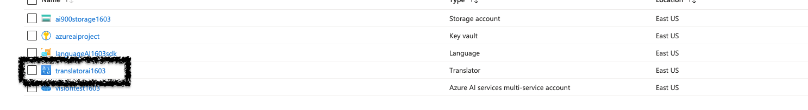
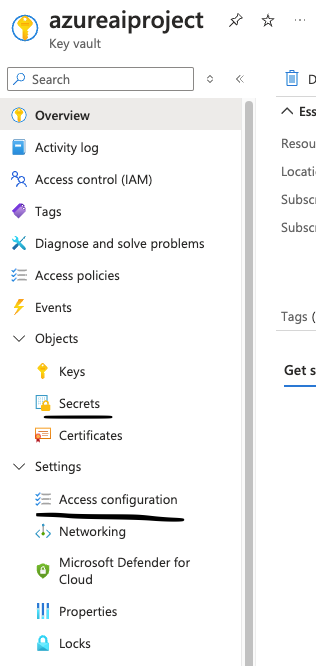
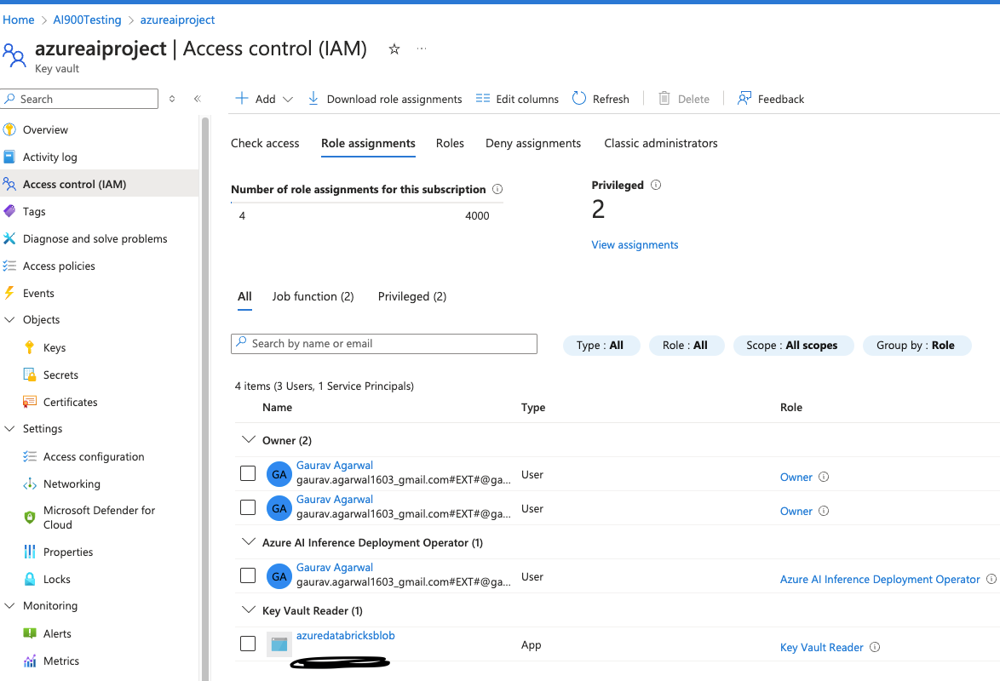

# **This project deals with Azure translation AI.**

## **Tech stack:**
1) Azure Cloud
2) Azure translation AI service
3) Azure key vault
4) Azure service principal - app registration
5) Python

1) Create an azure AI translation service

2) Create an Azure key vault

3) Create an app registration - and generate a secret inside

4) 
* In secret section-create a secret and copy the key value of AI translation.

* Also, go to IAM and give role assignment to service principal you created.

* In access configuration, give access to service principal to access the secret

5) Go to Pycharm IDE, create a new project
6) pip install -r requirements.txt in the venv env
7) Set the env variable of TENANT_ID, CLIENT_ID, SECRET_ID in python IDE

**Flow:**

Create AI Translation > Create a key vault > Create a service principal > Grant IAM role to service principal on key vault > Create a secret in key vault > Set the access policy for service principal > Create a python project > Install requirements.txt > Set the env variable in python IDE >  Run the code

### **Note: Do not show your keys in code, use the concept of service principal and key vault. Also, delete all the resources after use.**

